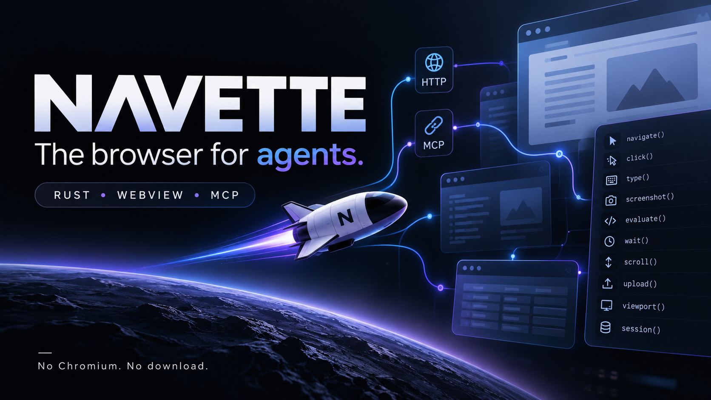

# navette — v1.7.0



> **The browser for agents.** One tiny Rust binary driving the WebView your OS already ships — no Chromium, no download, no RAM bonfire.

*Navette* is French for **shuttle** — the small vessel that carries your agent from page to page. Always fueled (the engine ships with your OS), light enough to ignore, and it skips the human web's garbage so your agent doesn't have to.

**Single Rust binary, three modes:**

```
$ ls -lh target/release/navette
-rwxr-xr-x  1 user  staff   626K  navette
```

626 KB installed on macOS (release binaries: 658 KB darwin-arm64, ~1.2 MB windows-x64 / linux-x64 — the wry backends carry their bindings). Playwright ships 218 MB. Lightpanda ships 96 MB (and cannot screenshot). Measured claims, reproducible with one command ([BENCHMARKS.md](BENCHMARKS.md)):

- **Faster than Playwright + Chromium on every metric we measured** — install, cold start, navigate→read (8 ms), act (1 ms), peak RAM, 100-page crawl (0.9–2.8 s, parity with Lightpanda within variance and ~2–3x faster than Playwright), real-web success rate (95–100% vs 85%).
- **Crawls at Lightpanda's speed while rendering** (parity within variance through the zero-bias raw-CDP probe, where Lightpanda is the fastest page-*reader* at 3.3–3.4 ms — it parses a partial DOM and cannot render — and navette is the **fastest full-rendering reader**: 17.9–19.4 ms vs Chromium's 28–34 ms through the identical client).
- **The two rows Lightpanda wins — fresh-process boot and peak RAM — are the price of rendering.** If your agent only reads static pages, use fetch + readability; if it needs JS, sessions, actions and vision, that price is the product.

## FAQ

**Why not Apple's Safari MCP server (2026)?** Same thesis, different scope: navette is agent-first (8 primitives, ghost windows, resident daemon), open source, and cross-platform by design (WebView2 on Windows *is* Chromium — preinstalled). Apple's is macOS-and-Safari-shaped.

**Why not just fetch + readability?** For static pages, do that — it beats everyone. navette exists for what fetch can't do: JS-built pages, logins, sessions, forms, screenshots, acting like a human.

**Why not an ML extraction model?** Two trades, not a ranking. Trained extraction models survive hostile HTML — agency templates, mangled CMS output — where a DOM walk picks the wrong node, at roughly **~600 ms of compute per page**. navette's native DOM walk costs **~10 ms per page** and wins wherever the markup is sane, which is most documentation, news and dev-tool pages — most of what agents actually read. The layers compose: when one target's markup is hostile enough that native extraction picks garbage, hand *that* page's raw HTML to an ML pass.

**Security?** The server binds 127.0.0.1 only, sessions use a non-persistent store — no cookies leak between runs. The agent's JS executes in the OS WebKit sandbox, not in your terminal. For anything beyond a private laptop, `--token SECRET` requires `Authorization: Bearer` on every route (except `/health`) — an MCP host attaches with the `NAVETTE_TOKEN` env var.

**Operator flags** (serve): `--proxy URL` (HTTP CONNECT / SOCKS5, wry backends — macOS follows the system proxy), `--user-agent UA` (per-serve override), `--idle-release MIN` (drop idle WebKit sessions, the daemon stays resident).

## Build & run

```sh
brew install slabbdev/navette/navette   # macOS arm64
cargo install navette-browser   # any platform, from source
docker run -i --rm ghcr.io/slabbdev/navette navette mcp   # container, stdio MCP (amd64+arm64)
navette serve --port 8765       # HTTP API on loopback
navette mcp                     # MCP stdio for agent hosts
navette install-daemon          # resident: warm from login
```

Or build from source:

```sh
cargo build --release          # rustup; macOS fully shipped — Windows (WebView2) / Linux (WebKitGTK) backends aboard
./target/release/navette serve --port 8765   # HTTP API on loopback
./target/release/navette mcp                 # MCP stdio for agent hosts
./target/release/navette install-daemon      # resident: warm from login, 24 ms first page
./target/release/navette uninstall-daemon
```

The `mcp` mode auto-starts `serve` if nothing is listening (it idles politely if the port is already served by another navette). The resident daemon is a LaunchAgent with KeepAlive — the cold start an agent feels drops to **24–37 ms**, forever.

## HTTP API (127.0.0.1 only, JSON)

| Route | Body | Returns |
|---|---|---|
| `GET /health` | — | `{ok, name, engine}` |
| `GET /sessions` | — | sessions with url + title |
| `POST /navigate` | `{url, session?, with_content?, format?}` | `{ok, url, title[, content]}` — `with_content` folds the read into one round-trip |
| `POST /read` | `{session?, format?}` markdown/text/html | `{ok, content}` |
| `POST /screenshot` | `{session?}` | PNG bytes |
| `POST /click` | `{selector, session?, wait_navigation?}` | `{ok}` (real mouse events; opt-in auto-wait for form-POST navigations) |
| `POST /type` | `{selector, value, session?}` | `{ok}` (React-safe native setter) |
| `POST /evaluate` | `{js, session?}` | `{ok, result}` |
| `POST /wait` | `{selector, ms?, session?}` | `{ok}` |
| `POST /sessions/state` | `{session}` | cookies JSON — the logged-in state |
| `POST /sessions/load` | `{session, cookies}` | `{ok, imported}` restore a logged-in state |
| `POST /sessions/viewport` | `{width, height, session?}` | `{ok, width, height}` set the viewport (default 1280x800) |
| `POST /hover` | `{selector, session?}` | `{ok}` (mouseover/mousemove at the element's center) |
| `POST /key` | `{key, selector?, session?}` | `{ok}` (keydown+keyup on the focused element) |
| `POST /scroll` | `{y?, selector?, session?}` | `{ok, y}` absolute scroll or scrollIntoView |
| `POST /upload` | `{selector, filename, content_base64, mime?, session?}` | `{ok, files}` — fills a file input with in-memory content (DataTransfer; no OS dialog) |
| `POST /sessions/close` | `{session}` | `{ok}` |

Sessions are created lazily; ghost windows are attached only when a screenshot needs them.

JS dialogs (`alert`/`confirm`/`prompt`) are auto-handled in-page: alert logs and no-ops, confirm accepts, prompt returns its default — agents never deadlock on a hidden modal.

## MCP for agent hosts

Register once (ZCode example, workspace `.zcode/config.json`):

```json
{ "mcp": { "servers": { "navette": {
    "command": "/abs/path/to/navette/target/release/navette",
    "args": ["mcp"]
} } } }
```

The host gets 16 tools: `navigate`, `read`, `screenshot` (returned as MCP image content — the agent *sees* the page), `click`, `hover`, `type`, `key`, `evaluate`, `wait`, `scroll`, `upload`, `viewport`, `sessions`, `session_close`, `state_export` / `state_import` (cookies — the Playwright `storageState` equivalent).

## Architecture

```
src/main.rs          HTTP server (std::net), routes, agent-first JS snippets
src/mcp.rs           MCP stdio adapter + serve auto-start
src/backend_macos.rs WKWebView via raw objc2 — ghost windows, lazy attach,
                     measured cold-start ordering (AppKit -> listener -> pre-warm)
src/backend_wry.rs   Windows (WebView2) / Linux (WebKitGTK) via wry + tao —
                     same surface, IPC-shim results, URL-matched navigation
src/backend_stub.rs  fallback for other targets (placeholder)
```

The 8 primitives are engine-agnostic; each platform backend is a thin layer over the system WebView behind this exact surface. Engine strategy: system-first, embedded fallback (WebView2 Fixed Version / WebKitGTK via apt / WPE) — see [ONEPAGER.md](ONEPAGER.md).

## Status

**v1.7.0 (2026-10-07)** — current. **Native keyboard input** shipped: `POST /key` attempts real OS-level events first (CGEvent on macOS, SendInput on Windows, XTEST on Linux — `isTrusted: true`) and falls back automatically to the synthetic dispatch, reporting which `mode` ran. Windows is the platform where native input is verified end-to-end; macOS and headless Linux fall back cleanly (see the native-input issue for exactly where each stands).  **Operator release**: `--token` (Bearer auth on the HTTP API), `--proxy` (HTTP CONNECT / SOCKS5 per serve), `--user-agent` (per-serve override).  **Idle-release watchdog**: `navette serve --idle-release 15` drops WebKit sessions after 15 minutes without requests — daemon stays resident, memory comes back, the next request re-warms on demand (validated on macOS and Linux). **16 MCP tools** including file upload (page-side DataTransfer — no OS dialog) and scroll; published on crates.io as [`navette-browser`](https://crates.io/crates/navette-browser) (`cargo install navette-browser` → `navette`); a `bench` workflow measures navigate/read/screenshot on all three engines. **CI green on all three OSes**: macOS (WKWebView), Windows (WebView2), Linux (WebKitGTK).

Recent releases: [v1.6.0](https://github.com/slabbdev/navette/releases/tag/v1.6.0) — the operator release (`--token`, `--proxy`, `--user-agent`), linux-arm64 asset · [v1.5.0](https://github.com/slabbdev/navette/releases/tag/v1.5.0) — idle-release watchdog (drop idle WebKit sessions, the daemon stays resident), the tollbooth bench harness, the native-vs-ML extraction trade documented · [v1.4.1](https://github.com/slabbdev/navette/releases/tag/v1.4.1) — container image (ghcr, amd64+arm64), --help/--version, brew tap, official MCP registry listing · [v1.3.0](https://github.com/slabbdev/navette/releases/tag/v1.3.0) — full platform parity (native screenshots per engine, cookie state export/import, viewport control, resident daemon everywhere, hover + key, auto-handled dialogs) · [v1.2.1](https://github.com/slabbdev/navette/releases/tag/v1.2.1) — hardening (five root-cause fixes, boot-time session pre-warm: first navigate 38 s → 83 ms on a cold CI VM).

Known gaps, stated plainly: real (OS-level) mouse input, request/response network interception, OS file-dialog automation. MIT.
