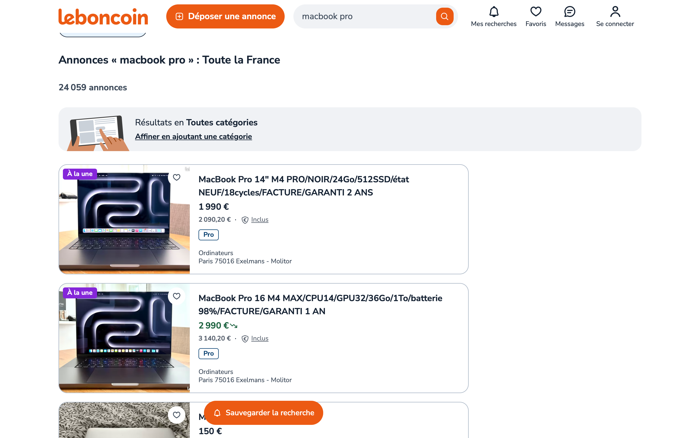

# Price stats from leboncoin.fr — the read-only recipe, via navette

leboncoin is France's classifieds giant: **no public read API**, Datadome
anti-bot, a React SPA where the listings are built client-side. Every
"just fetch it" approach gets an empty shell or a challenge page. navette
takes the path a human takes — the OS WebView, a residential exit IP, real
rendering — and the page simply reads. One `/navigate`, one `/evaluate`,
stats out.

**Read-only by design**: no login, no captcha handling, no retries. If the
site serves a challenge, the script reports `challenge` and stops.

## The run (2026-10-09, live)

```
$ NAVETTE=http://127.0.0.1:8766 python3 leboncoin.py stats "macbook pro" \
    --json stats-macbook-pro.json --shot leboncoin-search.png

leboncoin — 'macbook pro'  (35 ads scraped, pages: ok)
  market: 24 059 annonces au total
  price  min 120€ · median 450€ · mean 792€ · p90 1950€ · max 2990€
  pro sellers: 6%
  top locations: Paris (3), Poitiers (1), Saint-Sulpice-de-Pommeray (1), …
  categories: Ordinateurs (35)
```



The JSON keeps every ad (id, title, price, category, location, pro flag,
absolute URL) plus the per-page outcomes — a small, honest dataset of one
search page. `--pages 2` walks one more page (2.5 s apart, hard ceiling at
3), `--param locations=Paris` passes any native search filter through.

## Why this is the demo leboncoin deserves

- **Datadome passes without touching it.** No challenge solved, no headers
  forged — the system WebView *is* the human client. The tollbooth bench
  (`bench/`) measures this path at scale; here it just works.
- **Two UI layers cleared, honestly.** The Didomi consent banner is answered
  with "Continuer sans accepter" (grants nothing); the Gimii donation
  interstitial — a third-party `<dialog>` with no close control — is closed
  through the dialog's own DOM API. Neither is an access gate; no captcha is
  ever touched.
- **Zero infrastructure.** stdlib-only Python against `127.0.0.1`. No
  Chromium download, no driver, no vendor account.

## DOM facts the extraction rests on (verified live 2026-10-09)

| What | Where |
|---|---|
| search URL | `/recherche?text=…&page=N` (+ `category=<numeric id>`, native filters) |
| listing card | `[data-qa-id="aditem_container"]` (deduped by ad id — featured "À la une" cards repeat) |
| title | `article[aria-label]` / visible `p.text-body-1-highlight` |
| price | `p.text-callout`, French format `2 990 €` → int (fallback: `€` line) |
| meta | `p.text-caption` → `[category, "City INSEE"]` |
| pro seller | `sr-only` paragraph mentions "Vendeur professionnel" |
| market size | `h2` "Résultats de recherche : <n> annonces" |
| consent | `[data-qa-id="didomi_cta_continue_without_consent"]` |
| interstitial | `<dialog id="gimii-root">` (+ `.gimii_overlay` scrim) |

Class names are Tailwind role tokens, more stable than hashed modules but
still the site's styling — if extraction drifts, re-check this table first.

## Politeness is a feature

This is a recipe for "what does X cost today", not bulk scraping. leboncoin's
ToS restrict automated access, so the script stays human-sized: one request
per page, 2.5 s between pages, ≤ 3 pages, no retry loops, challenge → stop
and report. Run it the way you'd browse — occasionally, for yourself.
